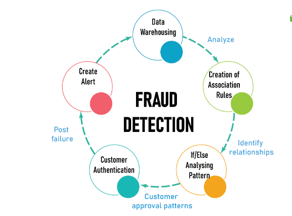

# Data Science Portfolio
---
## Machine learning

### Fraud Detection

Fraud detection is a set of processes and analyses that allow businesses to identify and prevent unauthorized financial activity. This can include fraudulent credit card transactions, identify theft, cyber hacking, insurance scams, and more.

---

### Numpy Contribution
Contributed in official Numpy library.
Dummy function created for learning under the upgrad course.

